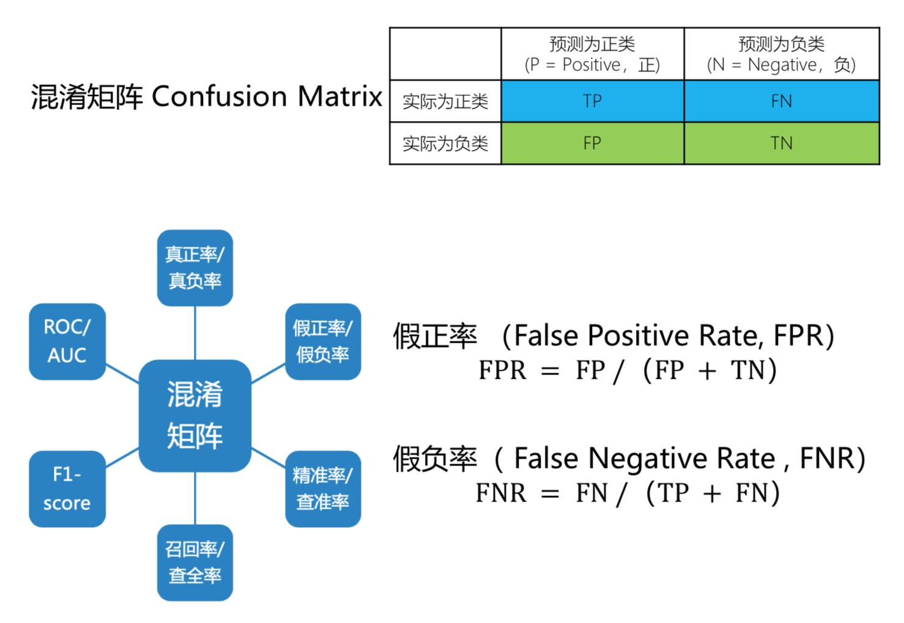
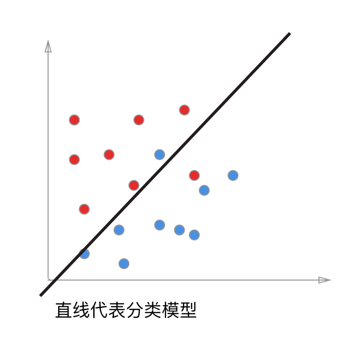
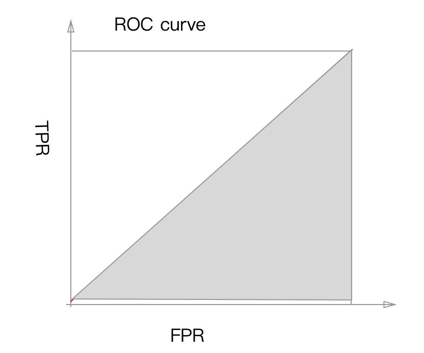
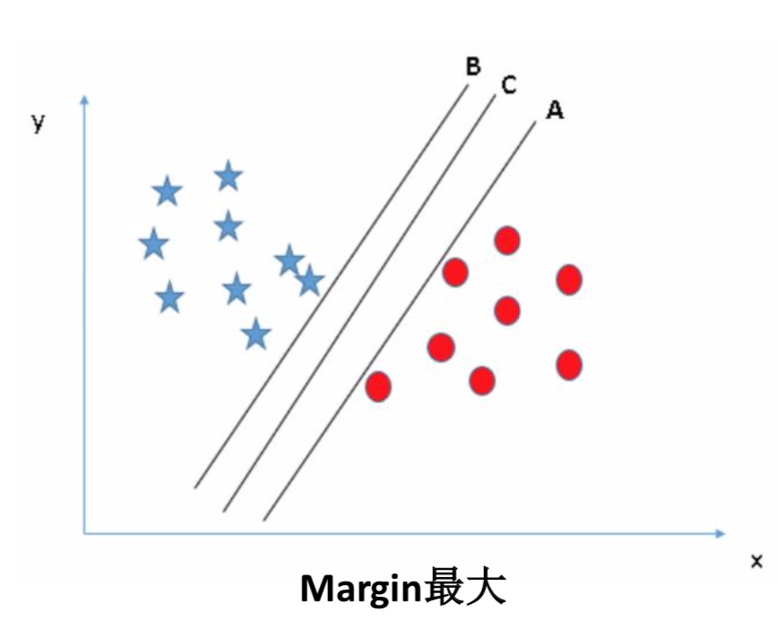
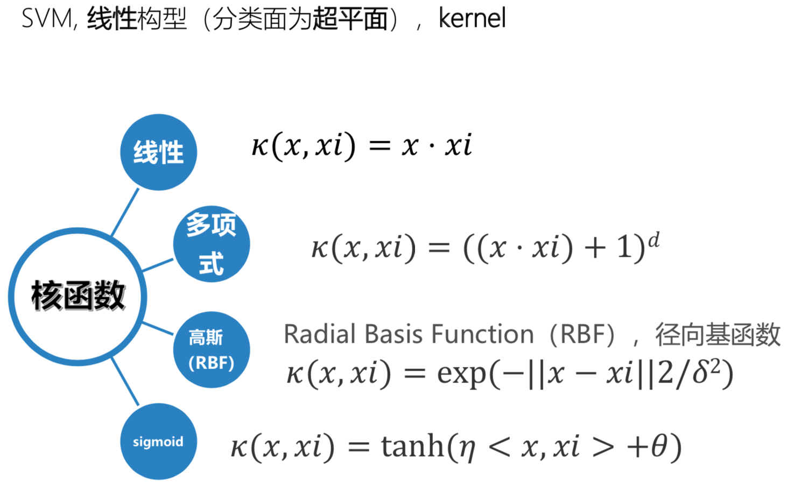

### 前置概念 - Metric

TP 真阳性; FN 假阴性; FP 假阳性; TN 真阴性

TPR 阳性里边被预测到的比率; TNR 阴性里边被预测到的比率

FPR 假阳率, 把没病的人预测为有病的概率; FNR 假阴率, 把有病的人预测为没病的概率

P 预测为阳性的样本, 真正是阳性的概率; R 阳性样本中被召回,被找到的概率

#### Receiver Operating Characteristic Curve (ROC)
二分类模型返回一个概率值，通过调整阈值，即大于该阈值为正类，反之负类，可以得到多个 (FPR,TPR)点，描点画图得到的曲线即为ROC曲线 
FPR = FP / (FP + TN)  
TPR = TP / (TP + FN)

左下角的点, TPR=0,FPR=0, 可以通过把所有样本都认为是负样本得来 
右上角的点, TPR=1,FPR=1, 可以通过把所有样本都认为是正样本得来 

举个例子, 一个分类问题,用下图简单表示,上面的每个点代表一条样本数据, 红的代表正样本, 蓝的代表负样本, 而中间的直线则是我们训练得到的模型, 调整阀值就是让直线上下偏移, 直线的角度不能改变(角度就是我们训练的模型的权重),每次调整直线的偏移都会改变直线与点之间的距离(模型对数据的分类依据)

下面我们把坐标系转一下, 这样二维的数据就变成一维的数据, 与直线的距离就是样本点在这个模型上的预测值

现在调整阀值问题可以转化为调整直线的上下偏移, 下面的图可以和前面ROC曲线的左下角对应, 把所有样本都预测为负样本, 这个时候TP=0, FP=0, TPR=0,FPR=0

然后直线再继续往下偏移, 这个时候模型的分类效果比较好,TP=9, FP=1, TPR=0.9, FPR=0.1

再继续往下, TP=10, FP=10, TPR=1, FPR=1, 这对应了ROC曲线的的右上角

ROC曲线绘制的思路大致是这样的, 通过调整预测为正样本和负样本的阈值(这里是直线的偏移), 然后通过计算在每个位置的TPR和FPR来获得曲线 

** Area Under Curve-(AUC) **
ROC曲线下面积，一般取值范围[0.5,1] AUC越大，分类模型效果越好 

下面是一个分类效果很理想的模型, 它可以取到ROC曲线左上角的红点, 即TPR=1,FPR=0

 图1

它的ROC图是这样的, 曲线包裹的面积 AUC=1.0

下面这个分类效果就很差, 不论这么移动直线, TPR和FPR基本相等

 
图2

它的ROC图是这样的, 曲线包裹的面积 AUC=0.5

#### Accuracy & AUC
只用精度评判模型的时候, 会被分布占多数的样本带偏 
AUC可以客观的评判模型在正样本和负样本上表现 
举个例子

上面的例子中, Accuracy=0.6, 而TPR = 0.75, FPR=1, AUC = ?
它的auc曲线可以是这样的, AUC可能会小于0.5, 这个模型的预测效果其实很差, 但是通过accuracy却无法体现

### 分类问题定义
### 分类算法
#### KNN(K-Nearest Neighbor)K最近邻
数据挖掘分类技术中最简单的方法之一,所谓K最近邻，就是K个最近的邻居,每个样本都可以用它最接近的K个邻居来代表

俗话说,“物以类聚, 人以群分”, 跟自己最接近的人是什么样的人, 自己也差不多是那类人 

##### 怎么定义接近? 通过距离

一个通用的定义

##### K的意义
上图中
蓝方块和红三角均是已有分类数据， 判断绿色圆块是属于蓝方块或者红三角?  
如果K=3:红三角占比2/3，则判断为红三角;  
如果K=9:蓝方块占比5/9，则判断为蓝方块。

##### 算法步骤
1. 计算已知类别数据集中的点与当前之间的距离
2. 按照距离递增次序排序
3. 选取与当前点距离最小的k个点
4. 确定前k个点所在的类别的出现频率
5. 返回前k个点出现频率最高的类别作为当前点的预测分类

#### Support Vector Machine(SVM)支持向量机
支持向量机(Support Vector Machine, SVM)的基本模型是在特征空间上找到最佳的分离超平面使得训练集上**  正负样本间隔最大**。

下面的数据在平面上不可分

但是把它变成3维数据之后, 就可以有一个平面把它们分割出来

##### 核函数

公式中x是参数, xi是元数据
* 线性核函数 κ(x,xi)=x⋅xi 
线性核，主要用于线性可分的情况，我们可以看到特征空间到输入空间的维度是一样的，其参数少速度快，对于线性可分数据，其分类效果很理想，因此我们通常首先尝试用线性核函数来做分类，看看效果如何，如果不行再换别的
* 多项式核函数 κ(x,xi)=((x⋅xi)+1)d  
多项式核函数可以实现将低维的输入空间映射到高纬的特征空间，但是多项式核函数的参数多，当多项式的阶数比较高的时候，核矩阵的元素值将趋于无穷大或者无穷小，计算复杂度会大到无法计算。
* 高斯（RBF）核函数 κ(x,xi)=exp(-||x−xi||2/δ2) 
高斯径向基函数是一种局部性强的核函数，其可以将一个样本映射到一个更高维的空间内，该核函数是应用最广的一个，无论大样本还是小样本都有比较好的性能，而且其相对于多项式核函数参数要少，因此大多数情况下在不知道用什么核函数的时候，优先使用高斯核函数。
* sigmoid核函数 κ(x,xi)=tanh(η<x,xi>+θ) 
采用sigmoid核函数，支持向量机实现的就是一种多层神经网络。

因此，在选用核函数的时候，如果我们对我们的数据有一定的先验知识，就利用先验来选择符合数据分布的核函数；如果不知道的话，通常使用交叉验证的方法，来试用不同的核函数，误差最下的即为效果最好的核函数，或者也可以将多个核函数结合起来，形成混合核函数。

##### Tips:
* 如果特征的数量大到和样本数量差不多，则选用LR或者线性核的SVM;
* 如果特征的数量小，样本的数量正常，则选用SVM+高斯核函数;

#### Logistic Regression 逻辑回归
LR 是一种广义线性回归(generalized linear model)

它的损失函数, MSE, mean square error, 均方差

<h4> 常见损失函数 </h4>
<li> 0-1损失函数 (0-1 loss function)

</li>

<li> 绝对损失函数 (absolute loss function)

</li>
<li> 平方损失函数 (quadratic loss function)

</li>
<li> 对数损失函数 (logarithmic loss function)
/对数似然损失函数 (loglikelihood loss function)

</li>

#### 极大似然估计方法(Maximum Likelihood Estimate，MLE)
根据给定的训练集估计出参数𝑤

##### Tips:
𝐿1 范数会选择少量的特征，其他的特征都是0; 
𝐿2 范数会选择更多的特征，这些特征都会趋近于0。  
如果在所有特征中，只有少数特征起主要作用的情况下， 那么选择𝐿1 范数比较合适，因为它能自动选择特征; 如果在所有特征中，大部分特征都能起作用， 而且起的作用很平均，那么使用𝐿2范数也许更合适。

如果模型的特征非常多，我们希望一些不重要特征的系数归零， 从而让模型的系数稀疏化，那么选择L1正则化。
如果我们需要相对精确的多元逻辑回归模型，那么L1正则化可能就不合适了。
在调参时，如果我们目的仅仅是为了解决过拟合问题，一般选择L2正则化就可以; 但是，如果选择L2正则化之后，发现还是存在过拟合的问题，就可以考虑L1正则化。

# lbfgs & gd

reference:  [svm常用核函数](https://blog.csdn.net/batuwuhanpei/article/details/52354822)
